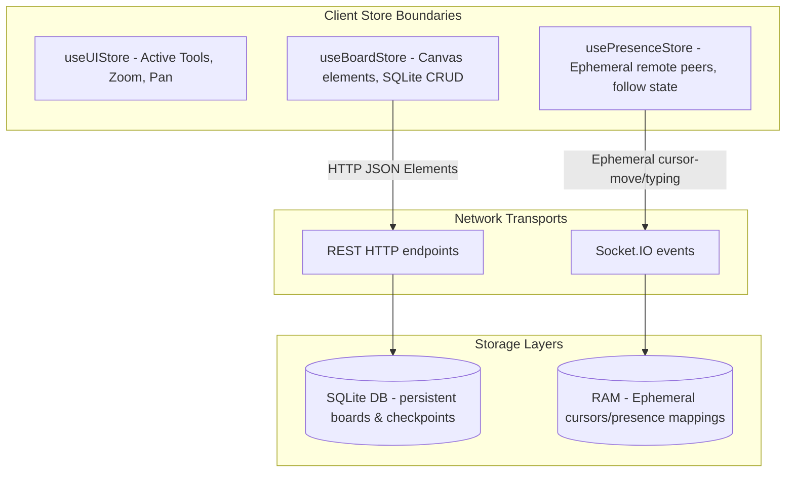

# SyncSketch Architectural Documentation

This document covers the frontend, backend, and network architecture of the SyncSketch collaborative whiteboard system.

---

## 1. Ephemeral vs. Persistent State separation

A core design principle of SyncSketch is the separation of **ephemeral (realtime collaboration)** state from **persistent (database-saved)** state.



### Persistent State
- **Store**: `useBoardStore`
- **Data**: Canvas elements, board titles, autosaves, named checkpoints, styles, dimensions.
- **Persistence**: Written to the SQLite backend via REST API JSON payloads on board actions and 1.5-second inactivity debounces.

### Ephemeral State
- **Store**: `usePresenceStore`
- **Data**: Remote peer coordinates (`x, y`), user displayNames, status circles, activity indicators (`✏ Drawing...`, `💬 Typing...`), cursor trail arrays.
- **Persistence**: None. Disconnect triggers immediate peer cleanup.

---

## 2. Cursor Interpolation & Trails solver
To prevent jumpy visual updates from remote network packets, we implement Client-side linear interpolation (lerp) running on a `requestAnimationFrame` render ticker.

### Lerp Mathematics
When a remote peer coordinates move:
1. The socket packet sets `targetX` and `targetY` in the store instead of directly modifying `x` and `y`.
2. A 60fps local rendering loop calculates:
   $$x_{next} = x_{current} + (x_{target} - x_{current}) \times 0.25$$
   $$y_{next} = y_{current} + (y_{target} - y_{current}) \times 0.25$$
3. This creates a smooth curve decay that glides the pointer to the target point, matching local hardware refresh rates.

### Cursor Trails
If Cursor Trails are toggled **ON**:
- Remote cursor coordinates are logged to a trail point queue (maximum 5 points).
- Each point opacity decays by `-0.05` per animation frame.
- Points are rendered as tiny circular dots matching the peer's avatar color, fading out rapidly as the pointer decelerates.

---

## 3. Viewport Camera & Follow User Mode
- **Find on canvas**: Retrieves followed user coordinates and sets:
  $$pan_{x} = -x_{peer} \times zoom + \frac{W_{window}}{2}$$
  $$pan_{y} = -y_{peer} \times zoom + \frac{H_{window}}{2}$$
- **Follow User**: Sets a subscriber loop. Whenever the followed user's cursor coordinates update, the local camera automatically re-centers to follow their view.
- **Interruption**: Manual canvas drag panning (`isPanning`) or mouse wheel scrolling immediately cancels following, restoring local viewport autonomy.

---

## 4. WebSocket Event Payloads

### `presence:join`
- Emitted on mounting a drawing board:
```json
{
  "boardId": "board-uuid",
  "userId": "user-uuid",
  "displayName": "Draft Fox",
  "avatar": "DF",
  "presenceColor": "#f97316"
}
```

### `cursor-move`
- Emitted on throttled mouse moves (maximum 30Hz):
```json
{
  "boardId": "board-uuid",
  "userId": "user-uuid",
  "x": 420.5,
  "y": 182.1,
  "activeTool": "pencil",
  "activity": "drawing",
  "drawingElement": {
    "id": "transient-id",
    "type": "pencil",
    "points": [100.5, 120.3, 105.1, 122.9],
    "stroke": "#3b82f6",
    "strokeWidth": 3
  }
}
```

### `presence-typing`
- Emitted on sticky/text editor changes:
```json
{
  "boardId": "board-uuid",
  "userId": "user-uuid",
  "isTyping": true
}
```

---

## 5. Real-time Ephemeral Drawing Sync Strategy

To achieve smooth, high-fidelity synchronization of active mouse drags (e.g., drawing lines, rectangles, arrows, or pencil brush strokes) without flooding backend storage or network sockets, the system employs a two-tier synchronization pipeline:

1. **Transient Phase (Active Dragging)**:
   - While a user is dragging, the shape geometry is stored locally inside an ephemeral state ref (`activeElementRef.current`).
   - Every 33ms (30Hz), the cursor coordinate broadcast (`cursor-move`) carries the transient shape's geometry under the `drawingElement` parameter.
   - Remote peers receiving this payload store it inside their ephemeral presence registry (`usePresenceStore`).
   - These in-progress shapes are dynamically rendered on the canvas inside the **Multiplayer Cursors Layer**. This keeps the database free from intermediate SQL updates, doesn't pollute the undo history, and avoids creating new WebSocket connections.
2. **Finalization Phase (Mouse Release)**:
   - Upon releasing the cursor, the local client checks if the shape is valid (above scale/movement thresholds).
   - If valid, the shape is persisted inside the global board store, saved via a REST request to the SQLite database, and broadcast via a single definitive `element-sync` socket event.
   - Concurrently, an instant `cursor-move` with `activity: 'idle'` is broadcast, prompting all other clients to clear the transient drawing rendering.

